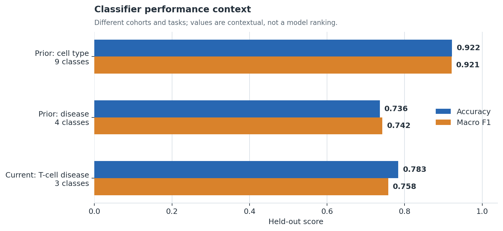
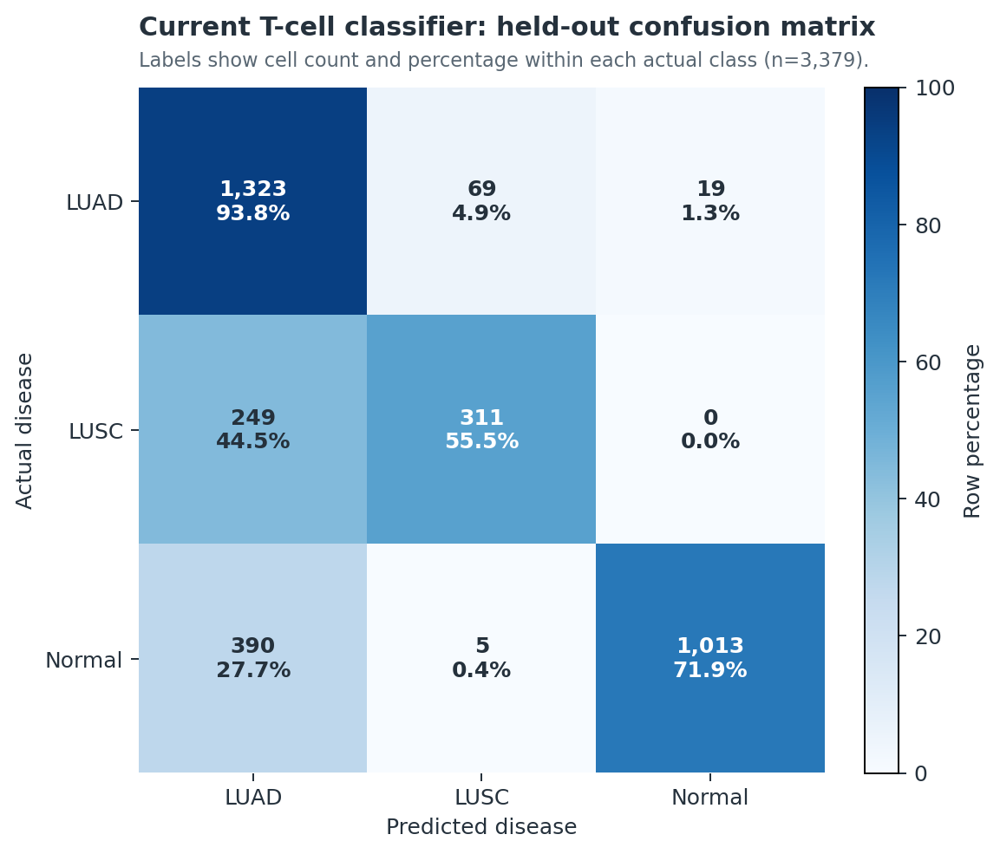

# Geneformer NSCLC T-cell workflow

This branch prioritizes the **17 July 2026** donor-held-out Geneformer workflow:
21,000 naturally balanced CD4/CD8 T cells, a three-state LUAD/LUSC/normal
classifier, and an all-gene in silico deletion screen.

## Current experiment

| Dataset | Donor control | Test performance | Perturbation |
|---|---|---|---|
| 7,000 LUAD + 7,000 LUSC + 7,000 normal; no oversampling | No donor crosses train/eval/test | Accuracy **0.7834**; macro F1 **0.7577** | **2,937,776** held-out cell-gene deletions running |

**Workflow:** atlas selection → donor-disjoint split → Geneformer V2 tokenization
→ fine-tuning → held-out evaluation → all-gene deletion.

[Overview](current_workflow/README.md) ·
[Methods](current_workflow/METHODS.md) ·
[Results](current_workflow/RESULTS.md) ·
[Live run status](current_workflow/monitoring/GPU_PROGRESS_REPORT.md)

## Key findings



The earlier whole-cohort classifiers and today's T-cell classifier address
different tasks; this chart provides context, not a head-to-head ranking.



The final model detects LUAD strongly. Its main limitation is LUSC recall, with
249 of 560 held-out LUSC cells called LUAD. This ambiguity is explicitly
considered when interpreting perturbation directions.

## Repository map

```text
current_workflow/               active fine-tuning, results, monitor, visuals
archive/prior_nsclc_workflow/   Step1-Step7 notebooks and earlier evidence
requirements.txt                lightweight environment specification
```

Large atlases, tokenized datasets, embeddings, checkpoints, and model weights
remain outside Git.
