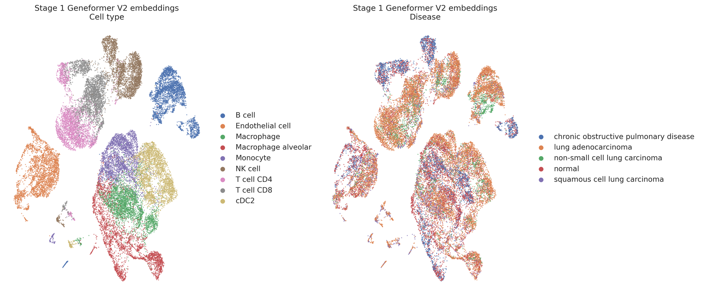
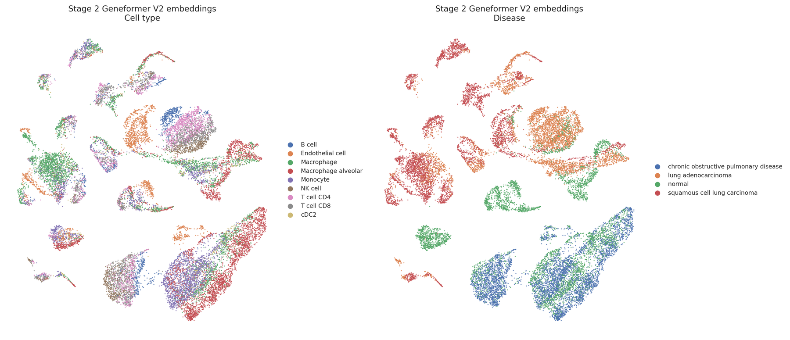

# Geneformer NSCLC T-cell workflow

For moving the active Geneformer experiment, trained model, perturbation
outputs, and reporting environment to another machine, see the
[reproducible migration workspace](migration/README.md).

For creating a project-agnostic Geneformer environment with `uv` on a clean
machine, see the [general Geneformer + uv setup](geneformer_uv_setup/README.md).

This branch prioritizes the **17 July 2026** donor-held-out Geneformer workflow:
21,000 naturally balanced CD4/CD8 T cells, a three-state LUAD/LUSC/normal
classifier, and an all-gene in silico deletion screen.

## Current experiment

| Dataset | Donor control | Test performance | Perturbation |
|---|---|---|---|
| 7,000 LUAD + 7,000 LUSC + 7,000 normal; no oversampling | No donor crosses train/eval/test | Accuracy **0.7834**; macro F1 **0.7577** | **2,937,776** held-out cell-gene deletions complete; 6/6 comparisons generated |

**Workflow:** atlas selection → donor-disjoint split → Geneformer V2 tokenization
→ fine-tuning → held-out evaluation → all-gene deletion.

[Overview](current_workflow/README.md) ·
[Methods](current_workflow/METHODS.md) ·
[Results](current_workflow/RESULTS.md) ·
[Live run status](current_workflow/monitoring/GPU_PROGRESS_REPORT.md)

## In silico perturbation concept


Each expressed gene token is deleted once, the fine-tuned model recalculates the
cell embedding, and movement is scored toward LUAD, LUSC, and normal reference
states. This image is conceptual; quantitative results come from the held-out
deletion screen.

## Key findings


The earlier whole-cohort classifiers and today's T-cell classifier address
different tasks; this chart provides context, not a head-to-head ranking.


The final model detects LUAD strongly. Its main limitation is LUSC recall, with
249 of 560 held-out LUSC cells called LUAD. This ambiguity is explicitly
considered when interpreting perturbation directions.

## UMAPs from prior fine-tuned models

| Stage 1: cell-type model | Stage 2: disease model |
|---|---|
|  |  |

Stage 1 embeddings organize strongly by cell identity. Stage 2 shifts the
representation toward disease structure while retaining overlap. These are
archived models and provide context for today's T-cell-specific workflow.

## Repository map

```text
current_workflow/               active fine-tuning, results, monitor, visuals
archive/prior_nsclc_workflow/   Step1-Step7 notebooks and earlier evidence
requirements.txt                lightweight environment specification
```

Large atlases, tokenized datasets, embeddings, checkpoints, and model weights
remain outside Git.
