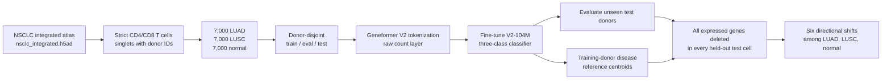

# Geneformer NSCLC T-cell fine-tuning and perturbation experiments

**Experiment date:** 17 July 2026  
**Compute environment:** NVIDIA GB10 (DGX Spark), Geneformer V2 104M  
**Final disease states:** normal, lung adenocarcinoma (LUAD), and squamous cell lung carcinoma (LUSC)

## Outcome

Today's work produced a donor-disjoint, no-oversampling T-cell dataset containing
7,000 cells per disease, fine-tuned a three-class Geneformer classifier, measured
its performance on unseen donors, and completed a genome-wide in silico deletion
screen on every held-out test cell.

The final classifier reached **0.7834 test accuracy** and **0.7577 macro F1**.
The all-gene perturbation screen and all six directional statistical
comparisons are complete; the final GPU and progress report is available in
[the monitoring directory](monitoring/GPU_PROGRESS_REPORT.md).
The report is generated by
[the monitoring job](monitoring/report_generation_job.sh) every 30 minutes
while new run state is available.

## Final workflow

## Experiment sequence

| Phase | Dataset/design | Purpose | Outcome |
|---|---|---|---|
| Initial three-state model | LUAD/LUSC/normal; train/eval classes resampled to at least 1,000; test donors untouched | Establish the perturbation classifier workflow | Test accuracy 0.8381; macro F1 0.8634, but the natural test cohort was small and imbalanced |
| COPD comparison | LUAD/normal/COPD; donor split before within-split oversampling | Test an alternate disease comparison and verify donor leakage controls | Test accuracy 0.7747; macro F1 0.7496; test metrics include duplicate cells and are not independent cell-level validation |
| Final atlas cohort | Strict CD4/CD8 T cells; 7,000 cells for each LUAD/LUSC/normal; no oversampling | Maximize clean LUSC use while preserving balance | 21,000 cells, 17,764 genes, donor leakage check passed |
| Final fine-tune | Geneformer V2-104M on the final atlas cohort | Produce the model used for perturbation | Test accuracy 0.7834; macro F1 0.7577 |
| Held-out deletion | Every gene token in every held-out test cell; training-only disease centroids | Identify deletions that shift cells among the three disease states | Complete; 2,937,776 valid cell-gene deletions across 3,379 cells and all six directional comparisons |

## Why the final model was selected

The initial experiments were useful implementation checks but relied on
oversampling. The final workflow instead uses the original large atlas, keeps
all three disease totals naturally balanced, prevents donor overlap among
splits, and leaves all test cells unmodified. This makes its pre-perturbation
performance and perturbation results easier to interpret as donor-held-out
evidence.

## Documents

- [Methods and reproducibility](METHODS.md)
- [Results and interpretation](RESULTS.md)
- [Machine-readable experiment manifest](experiment_manifest.json)
- [Live perturbation report](monitoring/GPU_PROGRESS_REPORT.md)
- [Perturbation statistics and biological interpretation](perturbation_statistics/README.md)
- [Next-stage evaluation workspace](perturbation_statistics/evaluation/README.md)

## Status terminology

- **Complete:** dataset construction, leakage audit, tokenization, fine-tuning,
  pre-perturbation evaluation, training-reference embeddings, and perturbation
  smoke test.
- **Complete:** full held-out all-gene deletion, the six aggregate directional
  comparisons, qualified gene rankings, and initial pathway interpretation.
- **Pending:** donor-consistency, contamination sensitivity, subtype analysis,
  external replication, and orthogonal validation of top perturbation hits.
