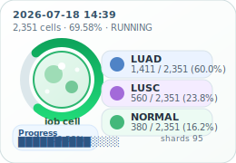
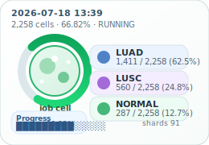
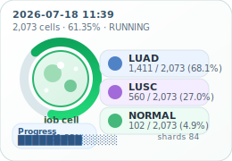
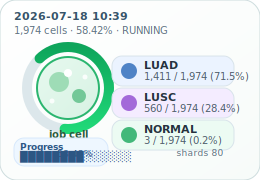
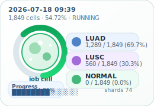

# Held-out all-gene deletion status

> **15-minute report job:** This report is generated from `latest_status.json`
> and `hourly_history.csv` on each run. Every snapshot includes a short delta
> summary, and the gallery below shows the recent single-cell snapshots. The
> thumbnails are orientation aids only; they are not measured ligand-receptor
> or pathology results.

## Current snapshot

**What changed since the prior report:** The run advanced by 93 cells and 4 shards, lifting completion from 66.82% to 69.58%. LUSC remained complete; LUAD remained complete; NORMAL moved from 287 to 380 cells; GPU utilization stayed at 96%.

| Metric | Value |
| --- | --- |
| Generated | 2026-07-18T14:39:30+09:00 |
| Run status | RUNNING |
| Overall cell progress | 2,351 / 3,379 (69.58%) |
| GPU | NVIDIA GB10 |
| GPU utilization | 96% |
| GPU temperature | 77 C |
| GPU power | 85.5 W |
| Perturbation GPU memory | 2,271 MiB |
| System memory used | 40.4 GiB |
| System memory available | 79.3 GiB |
| Swap used | 0.0 GiB |

### Progress by source

| Source | Cells | Shards | Raw files | Marker deletions |
| --- | --- | --- | --- | --- |
| LUSC | 560 / 560 (100.00%) | 23 / 23 | 1,120 | 348,313 / 348,313 |
| LUAD | 1,411 / 1,411 (100.00%) | 57 / 57 | 2,822 | 1,150,097 / 1,150,097 |
| NORMAL | 380 / 1,408 (26.99%) | 15 / 57 | 764 | 387,539 / 1,439,366 |

## Final statistical comparisons

**0 / 6 comparisons are complete. Final aggregation waits for the deletion screen, currently 95 / 137 shards.**

| Comparison | State | Result rows | Updated | Output |
| --- | --- | --- | --- | --- |
| LUSC → NORMAL | WAITING FOR PERTURBATION | — | — | `heldout_allgene_lusc_to_normal.csv` |
| LUSC → LUAD | WAITING FOR PERTURBATION | — | — | `heldout_allgene_lusc_to_luad.csv` |
| LUAD → NORMAL | WAITING FOR PERTURBATION | — | — | `heldout_allgene_luad_to_normal.csv` |
| LUAD → LUSC | WAITING FOR PERTURBATION | — | — | `heldout_allgene_luad_to_lusc.csv` |
| NORMAL → LUAD | WAITING FOR PERTURBATION | — | — | `heldout_allgene_normal_to_luad.csv` |
| NORMAL → LUSC | WAITING FOR PERTURBATION | — | — | `heldout_allgene_normal_to_lusc.csv` |

Result-row counts confirm artifact generation only; they do not establish
biological significance. Gene rankings should be interpreted only after all
six comparisons complete and coverage, FDR, and donor-consistency checks pass.

## Snapshot gallery

Each thumbnail is a single-cell diagram that encodes overall progress and the
LUAD, LUSC, and NORMAL pathology balance at that snapshot.

<table><thead><tr><th align="center">Single-cell snapshot</th><th align="center">Single-cell snapshot</th><th align="center">Single-cell snapshot</th></tr></thead><tbody><tr><td align="center" valign="top"> 2026-07-18T14:39:30+09:00 · 69.58% · 2,351 cells</td><td align="center" valign="top"> 2026-07-18T13:39:27+09:00 · 66.82% · 2,258 cells</td><td align="center" valign="top"> 2026-07-18T12:39:23+09:00 · 64.28% · 2,172 cells</td></tr><tr><td align="center" valign="top"> 2026-07-18T11:39:20+09:00 · 61.35% · 2,073 cells</td><td align="center" valign="top"> 2026-07-18T10:39:17+09:00 · 58.42% · 1,974 cells</td><td align="center" valign="top"> 2026-07-18T09:39:14+09:00 · 54.72% · 1,849 cells</td></tr></tbody></table>

## Monitoring history

Values are point-in-time monitor samples; brief compute and idle phases may occur between observations.

The history table below shows the newest samples first.

| Timestamp | Cells | Progress | GPU util | Temp | Power | Shards |
| --- | --- | --- | --- | --- | --- | --- |
| 2026-07-18T14:39:30+09:00 | 2,351 | 69.58% | 96% | 77 C | 85.5 W | 95 |
| 2026-07-18T13:39:27+09:00 | 2,258 | 66.82% | 96% | 76 C | 84.1 W | 91 |
| 2026-07-18T12:39:23+09:00 | 2,172 | 64.28% | 96% | 84 C | 88.8 W | 88 |
| 2026-07-18T11:39:20+09:00 | 2,073 | 61.35% | 96% | 81 C | 90.1 W | 84 |
| 2026-07-18T10:39:17+09:00 | 1,974 | 58.42% | 96% | 85 C | 89.0 W | 80 |
| 2026-07-18T09:39:14+09:00 | 1,849 | 54.72% | 96% | 78 C | 89.6 W | 74 |
| 2026-07-18T08:39:11+09:00 | 1,717 | 50.81% | 91% | 80 C | 90.1 W | 69 |
| 2026-07-18T07:39:07+09:00 | 1,577 | 46.67% | 0% | 62 C | 14.9 W | 63 |

## Job notes

- Job entrypoint: `current_workflow/monitoring/generate_progress_report.py`
- Statistics source: `/home/petadimensionlab/workspace/Geneformer/KD/tcell_luad_lusc_normal_luscmax7000_heldout_allgene_perturbation/stats` (override with `PERTURBATION_STATS_DIR`)
- Output files: `GPU_PROGRESS_REPORT.md`, `progress_animation.gif`, `progress_animation.svg`, `cell_interaction_diagram.svg`, and `snapshot_gallery/*.svg`
- Cadence: 15 minutes
