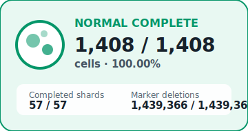

# Held-out all-gene deletion status

> **30-minute report job:** This report is generated from `latest_status.json`
> and `hourly_history.csv` on each run. Every snapshot includes a short delta
> summary. A single final diagram is appended for each disease source when its
> perturbation screen completes.

## Job run summaries

Newest refreshes are appended at the top and retained for the most recent
48 runs.

<!-- JOB_RUN_SUMMARIES_START -->
- **2026-07-19T03:00:01+09:00** — IDLE; 3,379 / 3,379 cells (100.00%). The run advanced by 0 cells and 0 shards, lifting completion from 100.00% to 100.00%. LUSC remained complete; LUAD remained complete; NORMAL remained complete; GPU utilization stayed at 1%.
- **2026-07-19T02:30:01+09:00** — RUNNING; 3,379 / 3,379 cells (100.00%). The run advanced by 22 cells and 2 shards, lifting completion from 99.35% to 100.00%. LUSC remained complete; LUAD remained complete; NORMAL finished; GPU utilization fell from 92% to 1%.
- **2026-07-19T02:00:01+09:00** — RUNNING; 3,357 / 3,379 cells (99.35%). The run advanced by 50 cells and 2 shards, lifting completion from 97.87% to 99.35%. LUSC remained complete; LUAD remained complete; NORMAL moved from 1,336 to 1,386 cells; GPU utilization stayed at 92%.
- **2026-07-19T01:30:01+09:00** — RUNNING; 3,307 / 3,379 cells (97.87%). The run advanced by 43 cells and 2 shards, lifting completion from 96.60% to 97.87%. LUSC remained complete; LUAD remained complete; NORMAL moved from 1,293 to 1,336 cells; GPU utilization fell from 96% to 92%.
- **2026-07-19T01:00:01+09:00** — RUNNING; 3,264 / 3,379 cells (96.60%). The run advanced by 43 cells and 1 shards, lifting completion from 95.32% to 96.60%. LUSC remained complete; LUAD remained complete; NORMAL moved from 1,250 to 1,293 cells; GPU utilization stayed at 96%.
- **2026-07-19T00:30:01+09:00** — RUNNING; 3,221 / 3,379 cells (95.32%). The run advanced by 55 cells and 3 shards, lifting completion from 93.70% to 95.32%. LUSC remained complete; LUAD remained complete; NORMAL moved from 1,195 to 1,250 cells; GPU utilization rose from 1% to 96%.
- **2026-07-19T00:00:01+09:00** — RUNNING; 3,166 / 3,379 cells (93.70%). The run advanced by 42 cells and 1 shards, lifting completion from 92.45% to 93.70%. LUSC remained complete; LUAD remained complete; NORMAL moved from 1,153 to 1,195 cells; GPU utilization fell from 96% to 1%.
- **2026-07-18T23:30:01+09:00** — RUNNING; 3,124 / 3,379 cells (92.45%). The run advanced by 49 cells and 2 shards, lifting completion from 91.00% to 92.45%. LUSC remained complete; LUAD remained complete; NORMAL moved from 1,104 to 1,153 cells; GPU utilization rose from 1% to 96%.
- **2026-07-18T23:00:01+09:00** — RUNNING; 3,075 / 3,379 cells (91.00%). The run advanced by 43 cells and 2 shards, lifting completion from 89.73% to 91.00%. LUSC remained complete; LUAD remained complete; NORMAL moved from 1,061 to 1,104 cells; GPU utilization stayed at 1%.
- **2026-07-18T22:30:01+09:00** — RUNNING; 3,032 / 3,379 cells (89.73%). The run advanced by 42 cells and 2 shards, lifting completion from 88.49% to 89.73%. LUSC remained complete; LUAD remained complete; NORMAL moved from 1,019 to 1,061 cells; GPU utilization fell from 92% to 1%.
- **2026-07-18T22:00:01+09:00** — RUNNING; 2,990 / 3,379 cells (88.49%). The run advanced by 42 cells and 1 shards, lifting completion from 87.24% to 88.49%. LUSC remained complete; LUAD remained complete; NORMAL moved from 977 to 1,019 cells; GPU utilization rose from 90% to 92%.
- **2026-07-18T21:30:01+09:00** — RUNNING; 2,948 / 3,379 cells (87.24%). The run advanced by 44 cells and 2 shards, lifting completion from 85.94% to 87.24%. LUSC remained complete; LUAD remained complete; NORMAL moved from 933 to 977 cells; GPU utilization rose from 1% to 90%.
- **2026-07-18T21:00:02+09:00** — RUNNING; 2,904 / 3,379 cells (85.94%). The run advanced by 45 cells and 2 shards, lifting completion from 84.61% to 85.94%. LUSC remained complete; LUAD remained complete; NORMAL moved from 888 to 933 cells; GPU utilization fell from 91% to 1%.
- **2026-07-18T20:30:01+09:00** — RUNNING; 2,859 / 3,379 cells (84.61%). The run advanced by 46 cells and 2 shards, lifting completion from 83.25% to 84.61%. LUSC remained complete; LUAD remained complete; NORMAL moved from 842 to 888 cells; GPU utilization rose from 1% to 91%.
- **2026-07-18T20:00:01+09:00** — RUNNING; 2,813 / 3,379 cells (83.25%). The run advanced by 47 cells and 2 shards, lifting completion from 81.86% to 83.25%. LUSC remained complete; LUAD remained complete; NORMAL moved from 795 to 842 cells; GPU utilization fell from 92% to 1%.
- **2026-07-18T19:30:01+09:00** — RUNNING; 2,766 / 3,379 cells (81.86%). The run advanced by 37 cells and 1 shards, lifting completion from 80.76% to 81.86%. LUSC remained complete; LUAD remained complete; NORMAL moved from 758 to 795 cells; GPU utilization fell from 96% to 92%.
- **2026-07-18T19:00:01+09:00** — RUNNING; 2,729 / 3,379 cells (80.76%). The run advanced by 37 cells and 2 shards, lifting completion from 79.67% to 80.76%. LUSC remained complete; LUAD remained complete; NORMAL moved from 721 to 758 cells; GPU utilization rose from 1% to 96%.
- **2026-07-18T18:30:01+09:00** — RUNNING; 2,692 / 3,379 cells (79.67%). The run advanced by 46 cells and 1 shards, lifting completion from 78.31% to 79.67%. LUSC remained complete; LUAD remained complete; NORMAL moved from 675 to 721 cells; GPU utilization fell from 75% to 1%.
- **2026-07-18T18:00:01+09:00** — RUNNING; 2,646 / 3,379 cells (78.31%). The run advanced by 16 cells and 1 shards, lifting completion from 77.83% to 78.31%. LUSC remained complete; LUAD remained complete; NORMAL moved from 659 to 675 cells; GPU utilization rose from 5% to 75%.
- **2026-07-18T17:52:31+09:00** — RUNNING; 2,630 / 3,379 cells (77.83%). The run advanced by 5 cells and 0 shards, lifting completion from 77.69% to 77.83%. LUSC remained complete; LUAD remained complete; NORMAL moved from 654 to 659 cells; GPU utilization fell from 91% to 5%.
- **2026-07-18T17:48:04+09:00** — RUNNING; 2,625 / 3,379 cells (77.69%). The run advanced by 12 cells and 1 shards, lifting completion from 77.33% to 77.69%. LUSC remained complete; LUAD remained complete; NORMAL moved from 642 to 654 cells; GPU utilization rose from 4% to 91%.
- **2026-07-18T17:41:08+09:00** — RUNNING; 2,613 / 3,379 cells (77.33%). The run advanced by 210 cells and 8 shards, lifting completion from 71.12% to 77.33%. LUSC remained complete; LUAD remained complete; NORMAL moved from 432 to 642 cells; GPU utilization fell from 91% to 4%.
<!-- JOB_RUN_SUMMARIES_END -->

## Current snapshot

**What changed since the prior report:** The run advanced by 0 cells and 0 shards, lifting completion from 100.00% to 100.00%. LUSC remained complete; LUAD remained complete; NORMAL remained complete; GPU utilization stayed at 1%.

| Metric | Value |
| --- | --- |
| Generated | 2026-07-19T03:00:01+09:00 |
| Run status | IDLE |
| Overall cell progress | 3,379 / 3,379 (100.00%) |
| GPU | NVIDIA GB10 |
| GPU utilization | 1% |
| GPU temperature | 46 C |
| GPU power | 12.5 W |
| Perturbation GPU memory | 0 MiB |
| System memory used | 37.7 GiB |
| System memory available | 82.0 GiB |
| Swap used | 0.0 GiB |

### Progress by source

| Source | Cells | Shards | Raw files | Marker deletions |
| --- | --- | --- | --- | --- |
| LUSC | 560 / 560 (100.00%) | 23 / 23 | 1,120 | 348,313 / 348,313 |
| LUAD | 1,411 / 1,411 (100.00%) | 57 / 57 | 2,822 | 1,150,097 / 1,150,097 |
| NORMAL | 1,408 / 1,408 (100.00%) | 57 / 57 | 2,834 | 1,439,366 / 1,439,366 |

## Final statistical comparisons

**All 6 directional comparisons have generated non-empty result tables. Statistical outputs are available for review.**

| Comparison | State | Result rows | Updated | Output |
| --- | --- | --- | --- | --- |
| LUSC → NORMAL | COMPLETE | 11,242 | 2026-07-19T02:22:21+09:00 | `heldout_allgene_lusc_to_normal.csv` |
| LUSC → LUAD | COMPLETE | 11,242 | 2026-07-19T02:17:15+09:00 | `heldout_allgene_lusc_to_luad.csv` |
| LUAD → NORMAL | COMPLETE | 13,458 | 2026-07-19T02:34:50+09:00 | `heldout_allgene_luad_to_normal.csv` |
| LUAD → LUSC | COMPLETE | 13,458 | 2026-07-19T02:28:35+09:00 | `heldout_allgene_luad_to_lusc.csv` |
| NORMAL → LUAD | COMPLETE | 14,923 | 2026-07-19T02:41:46+09:00 | `heldout_allgene_normal_to_luad.csv` |
| NORMAL → LUSC | COMPLETE | 14,923 | 2026-07-19T02:48:43+09:00 | `heldout_allgene_normal_to_lusc.csv` |

Result-row counts confirm artifact generation only; they do not establish
biological significance. Gene rankings should be interpreted only after all
six comparisons complete and coverage, FDR, and donor-consistency checks pass.

## Perturbation statistics and biological interpretation

The completed analysis applies a conservative ranking filter of
`Goal_end_FDR < 0.05`, positive goal shift, and at least 25 detections. Across
the six comparisons, 1,604 gene-comparison tests pass all three criteria.
Translation/ribosome and immune/inflammatory themes recur, with oxidative
phosphorylation strongest for LUAD → LUSC. Lung epithelial, alveolar, stromal,
and vascular transcripts among the leading T-cell shifts create a material
ambient-RNA/doublet risk; findings are therefore hypothesis-generating rather
than causal.

- [Portable technical report](../perturbation_statistics/perturbation_statistics_report.html)
- [Executed analysis notebook](../perturbation_statistics/perturbation_statistics.ipynb)
- [Goal-shift plots](../perturbation_statistics/figures/goal_shift_top_genes.png)
- [Biological pathway plot](../perturbation_statistics/figures/pathway_enrichment.png)

## Monitoring history

Values are point-in-time monitor samples; brief compute and idle phases may occur between observations.

The history table below shows the newest samples first.

| Timestamp | Cells | Progress | GPU util | Temp | Power | Shards |
| --- | --- | --- | --- | --- | --- | --- |
| 2026-07-19T03:00:01+09:00 | 3,379 | 100.00% | 1% | 46 C | 12.5 W | 137 |
| 2026-07-19T02:30:01+09:00 | 3,379 | 100.00% | 1% | 49 C | 12.8 W | 137 |
| 2026-07-19T02:00:01+09:00 | 3,357 | 99.35% | 92% | 79 C | 84.6 W | 135 |
| 2026-07-19T01:30:01+09:00 | 3,307 | 97.87% | 92% | 78 C | 84.3 W | 133 |
| 2026-07-19T01:00:01+09:00 | 3,264 | 96.60% | 96% | 75 C | 85.2 W | 131 |
| 2026-07-19T00:30:01+09:00 | 3,221 | 95.32% | 96% | 77 C | 84.1 W | 130 |
| 2026-07-19T00:00:01+09:00 | 3,166 | 93.70% | 1% | 66 C | 15.8 W | 127 |
| 2026-07-18T23:30:01+09:00 | 3,124 | 92.45% | 96% | 81 C | 82.4 W | 126 |

## Job notes

- Scheduled entrypoint: `current_workflow/monitoring/refresh_live_report.sh`
- Render entrypoint: `current_workflow/monitoring/generate_progress_report.py`
- Statistics source: `/home/petadimensionlab/workspace/Geneformer/KD/tcell_luad_lusc_normal_luscmax7000_heldout_allgene_perturbation/stats` (override with `PERTURBATION_STATS_DIR`)
- Output files: `GPU_PROGRESS_REPORT.md`, `progress_animation.gif`, `progress_animation.svg`, `cell_interaction_diagram.svg`, and `disease_completion/*.svg`
- Cadence: 30 minutes

## Disease completion diagrams

One final diagram is appended for each source after its perturbation screen completes. Cell totals are shown explicitly.

<table><tbody><tr><td align="center" valign="top"></td><td align="center" valign="top"></td><td align="center" valign="top"></td></tr></tbody></table>
