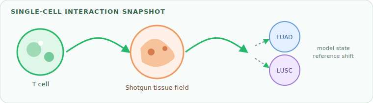
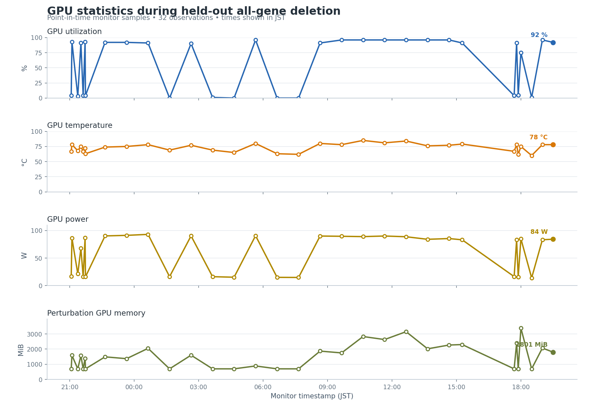
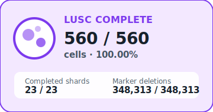
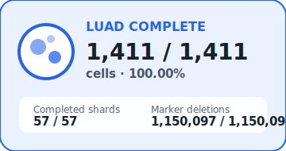

# Held-out all-gene deletion status

> **30-minute report job:** This report is generated from `latest_status.json`
> and `hourly_history.csv` on each run. Every snapshot includes a short delta
> summary. A single final diagram is appended for each disease source when its
> perturbation screen completes.

## Job run summaries

Newest refreshes are appended at the top and retained for the most recent
48 runs.

<!-- JOB_RUN_SUMMARIES_START -->
- **2026-07-18T19:30:01+09:00** — RUNNING; 2,766 / 3,379 cells (81.86%). The run advanced by 37 cells and 1 shards, lifting completion from 80.76% to 81.86%. LUSC remained complete; LUAD remained complete; NORMAL moved from 758 to 795 cells; GPU utilization fell from 96% to 92%.
- **2026-07-18T19:00:01+09:00** — RUNNING; 2,729 / 3,379 cells (80.76%). The run advanced by 37 cells and 2 shards, lifting completion from 79.67% to 80.76%. LUSC remained complete; LUAD remained complete; NORMAL moved from 721 to 758 cells; GPU utilization rose from 1% to 96%.
- **2026-07-18T18:30:01+09:00** — RUNNING; 2,692 / 3,379 cells (79.67%). The run advanced by 46 cells and 1 shards, lifting completion from 78.31% to 79.67%. LUSC remained complete; LUAD remained complete; NORMAL moved from 675 to 721 cells; GPU utilization fell from 75% to 1%.
- **2026-07-18T18:00:01+09:00** — RUNNING; 2,646 / 3,379 cells (78.31%). The run advanced by 16 cells and 1 shards, lifting completion from 77.83% to 78.31%. LUSC remained complete; LUAD remained complete; NORMAL moved from 659 to 675 cells; GPU utilization rose from 5% to 75%.
- **2026-07-18T17:52:31+09:00** — RUNNING; 2,630 / 3,379 cells (77.83%). The run advanced by 5 cells and 0 shards, lifting completion from 77.69% to 77.83%. LUSC remained complete; LUAD remained complete; NORMAL moved from 654 to 659 cells; GPU utilization fell from 91% to 5%.
- **2026-07-18T17:48:04+09:00** — RUNNING; 2,625 / 3,379 cells (77.69%). The run advanced by 12 cells and 1 shards, lifting completion from 77.33% to 77.69%. LUSC remained complete; LUAD remained complete; NORMAL moved from 642 to 654 cells; GPU utilization rose from 4% to 91%.
- **2026-07-18T17:41:08+09:00** — RUNNING; 2,613 / 3,379 cells (77.33%). The run advanced by 210 cells and 8 shards, lifting completion from 71.12% to 77.33%. LUSC remained complete; LUAD remained complete; NORMAL moved from 432 to 642 cells; GPU utilization fell from 91% to 4%.
<!-- JOB_RUN_SUMMARIES_END -->

## Current snapshot

**What changed since the prior report:** The run advanced by 37 cells and 1 shards, lifting completion from 80.76% to 81.86%. LUSC remained complete; LUAD remained complete; NORMAL moved from 758 to 795 cells; GPU utilization fell from 96% to 92%.

| Metric | Value |
| --- | --- |
| Generated | 2026-07-18T19:30:01+09:00 |
| Run status | RUNNING |
| Overall cell progress | 2,766 / 3,379 (81.86%) |
| GPU | NVIDIA GB10 |
| GPU utilization | 92% |
| GPU temperature | 78 C |
| GPU power | 84.3 W |
| Perturbation GPU memory | 1,801 MiB |
| System memory used | 39.6 GiB |
| System memory available | 80.1 GiB |
| Swap used | 0.0 GiB |

### Progress by source

| Source | Cells | Shards | Raw files | Marker deletions |
| --- | --- | --- | --- | --- |
| LUSC | 560 / 560 (100.00%) | 23 / 23 | 1,120 | 348,313 / 348,313 |
| LUAD | 1,411 / 1,411 (100.00%) | 57 / 57 | 2,822 | 1,150,097 / 1,150,097 |
| NORMAL | 795 / 1,408 (56.46%) | 31 / 57 | 1,601 | 796,333 / 1,439,366 |

## Final statistical comparisons

**0 / 6 comparisons are complete. Final aggregation waits for the deletion screen, currently 111 / 137 shards.**

| Comparison | State | Result rows | Updated | Output |
| --- | --- | --- | --- | --- |
| LUSC → NORMAL | WAITING FOR PERTURBATION | — | — | `heldout_allgene_lusc_to_normal.csv` |
| LUSC → LUAD | WAITING FOR PERTURBATION | — | — | `heldout_allgene_lusc_to_luad.csv` |
| LUAD → NORMAL | WAITING FOR PERTURBATION | — | — | `heldout_allgene_luad_to_normal.csv` |
| LUAD → LUSC | WAITING FOR PERTURBATION | — | — | `heldout_allgene_luad_to_lusc.csv` |
| NORMAL → LUAD | WAITING FOR PERTURBATION | — | — | `heldout_allgene_normal_to_luad.csv` |
| NORMAL → LUSC | WAITING FOR PERTURBATION | — | — | `heldout_allgene_normal_to_lusc.csv` |

Result-row counts confirm artifact generation only; they do not establish
biological significance. Gene rankings should be interpreted only after all
six comparisons complete and coverage, FDR, and donor-consistency checks pass.

## Monitoring history

Values are point-in-time monitor samples; brief compute and idle phases may occur between observations.

The history table below shows the newest samples first.

| Timestamp | Cells | Progress | GPU util | Temp | Power | Shards |
| --- | --- | --- | --- | --- | --- | --- |
| 2026-07-18T19:30:01+09:00 | 2,766 | 81.86% | 92% | 78 C | 84.3 W | 111 |
| 2026-07-18T19:00:01+09:00 | 2,729 | 80.76% | 96% | 78 C | 83.3 W | 110 |
| 2026-07-18T18:30:01+09:00 | 2,692 | 79.67% | 1% | 60 C | 14.1 W | 108 |
| 2026-07-18T18:00:01+09:00 | 2,646 | 78.31% | 75% | 75 C | 85.2 W | 107 |
| 2026-07-18T17:52:31+09:00 | 2,630 | 77.83% | 5% | 62 C | 15.7 W | 106 |
| 2026-07-18T17:48:04+09:00 | 2,625 | 77.69% | 91% | 78 C | 83.2 W | 106 |
| 2026-07-18T17:41:08+09:00 | 2,613 | 77.33% | 4% | 67 C | 16.5 W | 105 |
| 2026-07-18T15:16:02+09:00 | 2,403 | 71.12% | 91% | 79 C | 83.2 W | 97 |

## Job notes

- Scheduled entrypoint: `current_workflow/monitoring/refresh_live_report.sh`
- Render entrypoint: `current_workflow/monitoring/generate_progress_report.py`
- Statistics source: `/home/petadimensionlab/workspace/Geneformer/KD/tcell_luad_lusc_normal_luscmax7000_heldout_allgene_perturbation/stats` (override with `PERTURBATION_STATS_DIR`)
- Output files: `GPU_PROGRESS_REPORT.md`, `progress_animation.gif`, `progress_animation.svg`, `cell_interaction_diagram.svg`, and `disease_completion/*.svg`
- Cadence: 30 minutes

## Disease completion diagrams

One final diagram is appended for each source after its perturbation screen completes. Cell totals are shown explicitly.

<table><tbody><tr><td align="center" valign="top"></td><td align="center" valign="top"></td></tr></tbody></table>
